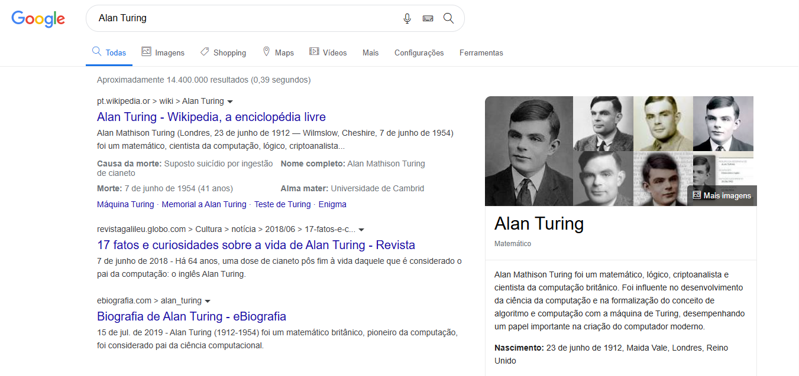

# Google-Search

📌 **Sobre o Projeto** 

Este projeto é um clone da página de pesquisa do Google, desenvolvido com HTML5 e CSS3 para fins educacionais e de prática em desenvolvimento web.

---

🚀 **Funcionalidades**

- Interface similar à página de pesquisa do Google
- Barra de pesquisa centralizada
- Layout responsivo
- Exibição de resultados simulados

---

⚙️ **Tecnologias Utilizadas**

- HTML5
- CSS3 (incluindo estilos responsivos)

---

🎨 **Estilização**

O CSS foi utilizado para recriar o design da página de pesquisa do Google, incluindo:

- Fonte semelhante à usada pelo Google
- Layout com flexbox e grid para melhor responsividade
- Estilização da barra de pesquisa e dos botões

---

📷 **Captura de Tela** 


---

🔧 **Como Usar**

1. Clone o repositório:

   ```bash
   git clone https://github.com/seu-usuario/google-search-clone.git

2. Abra o arquivo `index.html` no seu navegador.

